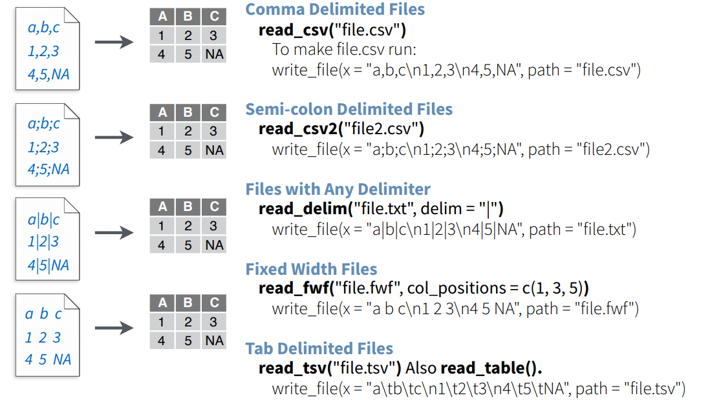
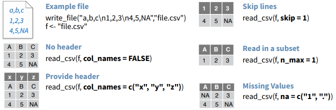

# Computación Estadística con R<br>Importación de Datos<br><small>Joshua Kunst</small>{ .center .white data-background="#75AADB" }

```{r, include = FALSE}
source("R/setup.R")
knitr::opts_chunk$set(fig.path = "static/img/02/", echo = TRUE)
```

# Importación { .center .white data-background="#75AADB" }

## Orígenes

Los datos puden venir de muchas fuentes:

- Archivo de texto
- Excel
- SPSS
- Bases de Datos
- Desde una página web
- Una API

## Ejemplo Motivacional

Revisar script `ejemplo-portalisimo.R`

## Funciones para importar

Dependiendo de la fuente se requiere uan __función__ de un
__paquete__ en particular

- Si es archivo de texto csv: `read_csv` del paquete `readr`
- Si es un archivo de texto:  `read_delim` del paquete `readr` es una función más general
- Si es un excel: `read_excel` del paquete `readxl`
- Si es un archivo SPSS `read_sav` del paquete `haven`

## Material

- https://github.com/rstudio/cheatsheets/raw/master/translations/spanish/data-import-cheatsheet_Spanish.pdf
- https://github.com/rstudio/cheatsheets/raw/master/translations/spanish/data-wrangling-cheatsheet_Spanish.pdf
- https://github.com/rstudio/cheatsheets/raw/master/translations/spanish/data-transformation_Spanish.pdf

Mucho más en https://www.rstudio.com/resources/cheatsheets/ 

## Detalles en `read_csv` y `read_delim`



## Parámetros



## Ejemplo 1

```{r}
library(readr)
storms <- read_csv("data/storms.csv")
storms
```

## Ejemplo 2

```{r}
pollution <- read_csv("data/pollution.csv")
pollution
```

## Ejemplo 3

```{r, error=TRUE}
library(readxl)
datos <- read_excel("data/muestrame_los_numeros.xlsx")
datos
```

## Ejercicios

- Ir a http://datos.gob.cl y obtener alguna tabla de tarjetas BIP
- Ir a http://www.deis.cl/ y descargue cualquier tabla/excel
- Leer en R cada una
- Suerte XD


