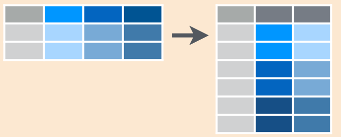
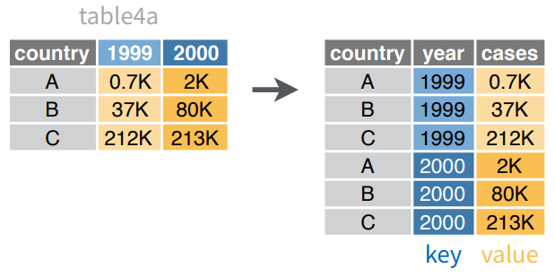
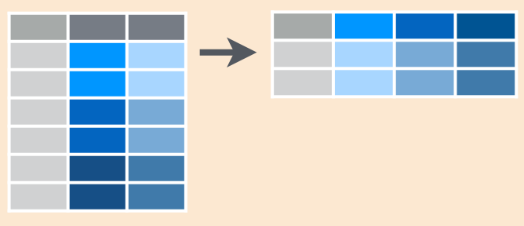
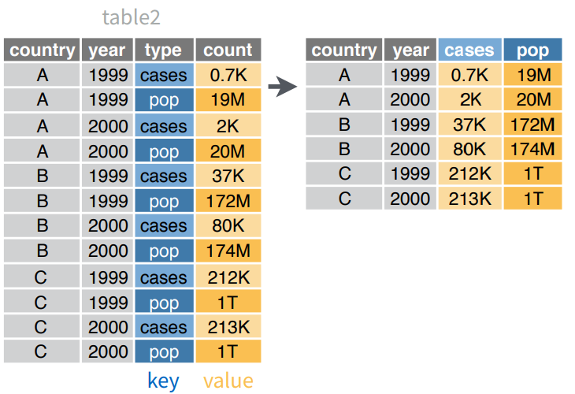

# Computación Estadística con R<br>Manipulación de Datos<br><small>Joshua Kunst</small>{ .center .white data-background="#75AADB" }

```{r, include = FALSE}
source("R/setup.R")
knitr::opts_chunk$set(fig.path = "static/img/03/", echo = TRUE)
```

# Manejo de Datos { .center .white data-background="#75AADB" }

## Antes el %>% 

Ir a RStudio. Yay!

## Importar datos

```{r}
library(tidyverse)
storms <- read_csv("data/storms.csv")
storms
```

----

```{r}
pollution <- read_csv("data/pollution.csv")
pollution
```

## `filter` Seleccionar Filas


## `filter` Ejemplo 


## `filter` Código

```
filter(storms, storm %in% c("Alberto", "Ana"))
```

```{r}
storms %>% 
  filter(storm %in% c("Alberto", "Ana"))
```

## `select` Seleccionar Columnas


## `select` Ejemplo 


## `select` Código

```
select(storms, storm, pressure)
```
```{r}
storms %>% 
  select(storm, pressure)
```

----

Versión alternativa

```{r}
storms %>% 
  select(-wind, -date)
```


## `arrange` Ordenar Filas


## `arrange` Ejemplo 


## `arrange` Código

```
arrange(storms, wind)
```

```{r}
storms %>% 
  arrange(wind)
```

## `mutate` Crear/Modificar columnas


## `mutate` Ejemplo 


## `mutate` Código

```
mutate(storms, ratio = pressure/wind, inverse = 1/ratio)
```
```{r}
storms %>% 
  mutate(ratio = pressure/wind, inverse = 1/ratio)
```

## `summarize` Resumir Columnas


## `summarize` Ejemplo 


## `summarise` Código

```
summarise(pollution, median = median(amount))
```

```{r}
pollution %>% 
  summarise(median = median(amount))
```

## `group_by` + `summarize` Resumir Columnas por Grupos


## `group_by` + `summarize` Ejemplo 


## `group_by` + `summarise` Código

```{r}
pollution %>%
  group_by(city) %>% 
  summarise(
    promedio = median(amount),
    suma = sum(amount),
    n = n()
    )
```

## Ejercicios { .center }

Revisemos el archivo `03-script-manipulacion-datos-01.R`

Con el archivo de http://datos.gob.cl/dataset/28198

- ¿Cuatos registros y filas tiene la tabla?
- ¿Cual es la comuna con mas puntos BIP!?
- ¿Cual es la entidad/comuna menos repetida?
- ¿Cuantos centros BIP existen en La Florida?


# Manejo de Datos 2 { .center .white data-background="#75AADB" }


## Importar datos


```{r}
songs <- read_csv("data/songs.csv")
songs
```

----

```{r}
artists <- read_csv("data/artists.csv")
artists
```

## `left_join` Juntar tablas


## `left_join` Código


```{r}
left_join(songs, artists, by = "name")
```


## Importar datos 2

```{r}
library(tidyverse)
data("table4a")
table4a
```

----

```{r}
data("table2")
table2
```

----

```{r}
cases <- read_csv("data/cases.csv")
cases
```

¿Como obtendríamos el promedio por país?

## ¿Como obtendríamos el promedio por país?

```{r}
cases %>% 
  mutate(promedio = (`2011` + `2012` + `2013`)/3)
```

Ahora pensemos en una tabla más grande, con más años 

## `gather` Recolectar 

Coloca nombres de columnas en una variable (columna) __key__, recolectando los 
valores (__value__) de las columnas en un __sola__ columna



## `gather` Ejemplo 



## `gather` Código

```{r}
gather(table4a, `1999`, `2000`, key = "year", value = "cases")
```


## `spread` Esparcir

Esparce un par de columnas (2, key-value) en multiples columnas 



## `spread` Ejemplo 



## `spread` Código


```{r}
spread(table2, type, count)
```

## Ejercicios { .center }

Revisemos el archivo `03-script-manipulacion-datos-02.R`
